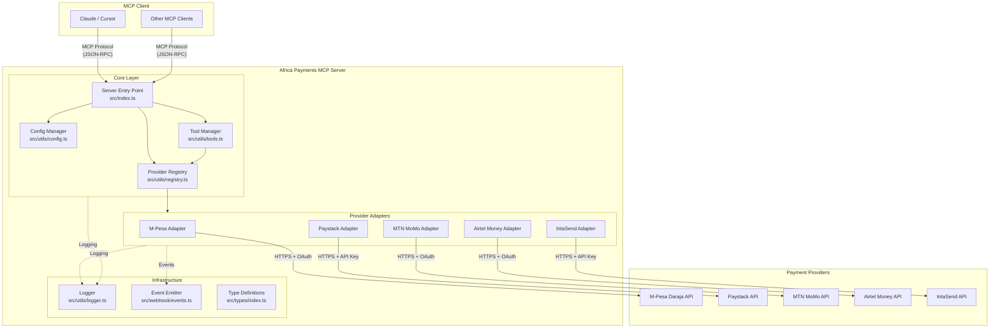
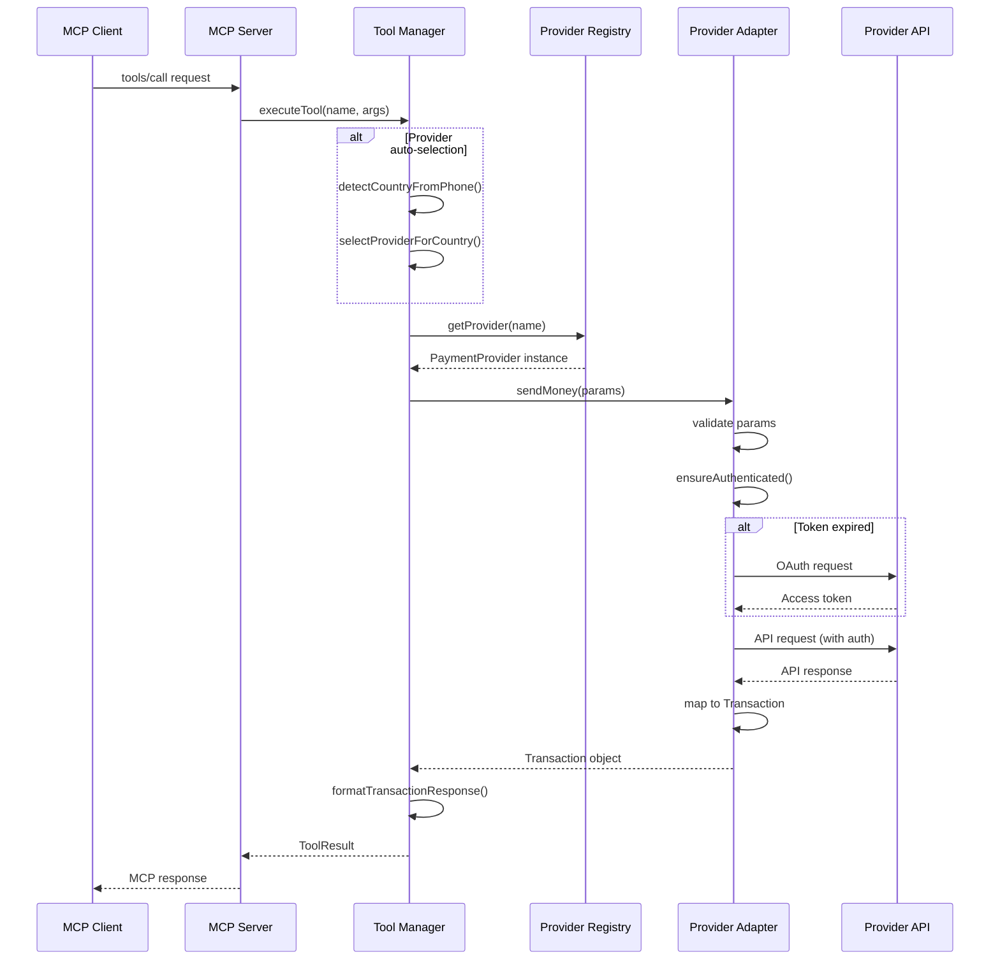
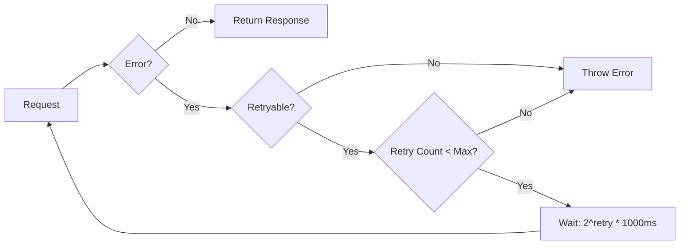

# Africa Payments MCP - Architecture Overview

> **Document Version:** 1.0  
> **Last Updated:** 2026-02-16  
> **Status:** Approved for Implementation

---

## Design Principles

### 1. Adapter Pattern
Each payment provider is implemented as an adapter that conforms to the `PaymentProvider` interface. This allows:
- Uniform interaction with different providers
- Easy swapping of providers without changing business logic
- Isolated provider-specific complexity

### 2. Plugin Architecture
New providers can be added without modifying core code:
```typescript
// Register new provider
registry.register('flutterwave', new FlutterwaveAdapter(config));
```

### 3. Fail-Fast
- Configuration validation during initialization
- Clear, actionable error messages
- Early detection of misconfiguration

### 4. Observability
- Structured logging at all layers
- Event emission for all state changes
- Metrics collection points (extensible)

### 5. Security First
- No API keys in logs
- PII masking in error messages
- Webhook signature verification
- Environment-based credential management

---

## System Architecture

### High-Level Architecture Diagram



### Data Flow Sequence



---

## Provider Adapter Interface

All adapters must implement the `PaymentProvider` interface:

```typescript
export interface PaymentProvider {
  // Metadata
  readonly name: string;
  readonly displayName: string;
  readonly countries: string[];
  readonly currencies: string[];
  readonly supportedMethods: PaymentMethod[];
  readonly config: ProviderConfig;

  // Lifecycle
  initialize(config: Record<string, any>): Promise<void>;
  
  // Core Operations (Required)
  sendMoney(params: SendMoneyParams): Promise<Transaction>;
  requestPayment(params: RequestPaymentParams): Promise<Transaction>;
  verifyTransaction(id: string): Promise<Transaction>;
  refund(params: RefundParams): Promise<Transaction>;
  
  // Optional Operations
  getBalance?(): Promise<Money>;
  getRates?(from: string, to: string): Promise<number>;
  validatePhone?(phone: string): Promise<boolean>;
  listTransactions?(query: TransactionQuery): Promise<Transaction[]>;
  
  // Webhook Support
  parseWebhook?(payload: any, signature?: string): Promise<Transaction>;
  verifyWebhookSignature?(payload: any, signature: string): Promise<boolean>;
}
```

### Adapter Implementation Pattern

```typescript
export class ExampleAdapter implements PaymentProvider {
  // 1. Metadata properties
  readonly name = 'example';
  readonly displayName = 'Example Provider';
  readonly countries = ['KE', 'NG'];
  readonly currencies = ['KES', 'NGN'];
  readonly supportedMethods = ['mobile_money'];

  // 2. HTTP client (axios instance with interceptors)
  private client: AxiosInstance;

  constructor(public readonly config: ExampleConfig) {
    this.client = axios.create({...});
    this.setupInterceptors();
  }

  // 3. Lifecycle
  async initialize(): Promise<void> {
    // Validate config, authenticate
  }

  // 4. Core operations with error handling
  async sendMoney(params: SendMoneyParams): Promise<Transaction> {
    try {
      // Implementation
    } catch (error) {
      this.handleError(error, 'sendMoney');
    }
  }

  // 5. Error mapper (provider-specific to standard)
  private handleError(error: unknown, operation: string): never {
    // Map to PaymentError with appropriate ErrorCode
  }
}
```

---

## Error Handling Strategy

### Error Hierarchy

```
PaymentError (base)
├── Configuration Errors
│   ├── INVALID_CONFIG
│   └── PROVIDER_NOT_AVAILABLE
├── Validation Errors
│   ├── INVALID_AMOUNT
│   ├── INVALID_PHONE
│   ├── INVALID_CURRENCY
│   └── MISSING_REQUIRED_FIELD
├── Provider Errors
│   ├── PROVIDER_ERROR
│   ├── INSUFFICIENT_FUNDS
│   ├── TRANSACTION_FAILED
│   ├── TRANSACTION_NOT_FOUND
│   └── DUPLICATE_TRANSACTION
├── Network Errors
│   ├── NETWORK_ERROR
│   ├── TIMEOUT_ERROR
│   └── RATE_LIMITED
└── Auth Errors
    ├── AUTHENTICATION_FAILED
    └── PERMISSION_DENIED
```

### Retry Strategy



### Retryable Errors
- Network timeouts (ECONNABORTED, ETIMEDOUT)
- 5xx server errors
- 401 authentication expired (retry once after re-auth)
- Rate limited (429) - with exponential backoff

### Non-Retryable Errors
- 400 bad request
- 403 forbidden
- 404 not found
- Invalid configuration

---

## Extensibility Guide

### Adding a New Provider

#### Step 1: Create Adapter Class
```typescript
// src/adapters/flutterwave/index.ts
export class FlutterwaveAdapter implements PaymentProvider {
  readonly name = 'flutterwave';
  readonly displayName = 'Flutterwave';
  readonly countries = ['NG', 'GH', 'KE', 'ZA', 'UG', 'TZ'];
  readonly currencies = ['NGN', 'GHS', 'KES', 'ZAR', 'UGX', 'TZS', 'USD'];
  readonly supportedMethods = ['card', 'bank_transfer', 'mobile_money'];

  constructor(public readonly config: FlutterwaveConfig) {}

  async initialize(): Promise<void> {
    // Validate and initialize
  }

  async sendMoney(params: SendMoneyParams): Promise<Transaction> {
    // Implement transfer
  }

  // ... implement other required methods
}
```

#### Step 2: Add Type Definition
```typescript
// src/types/index.ts
export interface FlutterwaveConfig extends ProviderConfig {
  publicKey: string;
  secretKey: string;
  encryptionKey: string;
}

// Add to ServerConfig
export interface ServerConfig {
  providers: {
    // ... existing providers
    flutterwave?: FlutterwaveConfig;
  };
  // ...
}
```

#### Step 3: Export from Adapters Index
```typescript
// src/adapters/index.ts
export { FlutterwaveAdapter } from './flutterwave/index.js';
```

#### Step 4: Register in Server
```typescript
// src/index.ts
import { FlutterwaveAdapter } from './adapters/flutterwave/index.js';

private async registerProviders(): Promise<void> {
  // ... existing providers
  
  if (this.config.providers.flutterwave?.enabled) {
    this.registry.register('flutterwave', new FlutterwaveAdapter(this.config.providers.flutterwave));
    this.logger.info('💳 Registered: Flutterwave');
  }
}
```

#### Step 5: Add Tests
```typescript
// tests/adapters/flutterwave.test.ts
describe('FlutterwaveAdapter', () => {
  // Unit tests
});
```

#### Step 6: Update Documentation
- Add to README.md provider table
- Add configuration example
- Update this ARCHITECTURE.md

---

## Module Dependencies

```
src/index.ts
├── adapters/index.ts
│   ├── mpesa/index.ts → axios
│   ├── paystack/index.ts
│   ├── mtn-momo/index.ts
│   ├── airtel-money/index.ts
│   └── intasend/index.ts
├── utils/config.ts → fs/promises
├── utils/registry.ts
├── utils/tools.ts
├── utils/logger.ts
├── types/index.ts
└── webhook/events.ts → events
```

---

## Configuration Schema

```json
{
  "providers": {
    "mpesa": {
      "enabled": true,
      "environment": "sandbox",
      "consumerKey": "string",
      "consumerSecret": "string",
      "passkey": "string",
      "shortCode": "string",
      "timeoutMs": 30000,
      "retryAttempts": 3
    }
  },
  "defaults": {
    "currency": "KES",
    "country": "KE",
    "provider": "mpesa"
  },
  "server": {
    "logLevel": "info",
    "webhookBaseUrl": "https://example.com/webhooks"
  }
}
```

---

## Review Notes

### Strengths
1. Clean adapter pattern implementation
2. Comprehensive type definitions
3. Good separation of concerns
4. Event-driven webhook handling
5. Auto-provider selection logic

### Areas for Improvement
1. See [CODE_QUALITY.md](./CODE_QUALITY.md) for detailed recommendations
2. Consider adding circuit breaker pattern for provider failures
3. Implement connection pooling for better performance
4. Add metrics collection hooks

---

*Architecture approved for production use by Elder KenyaClaw*
